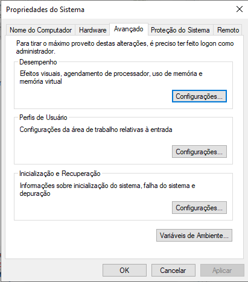
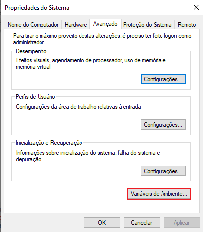
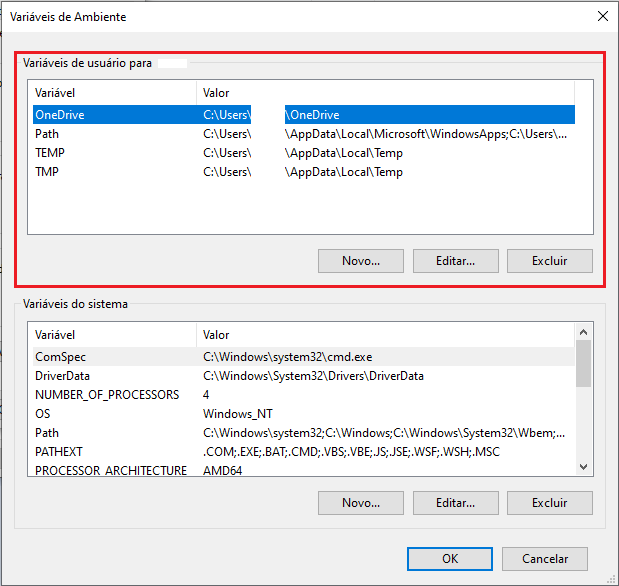
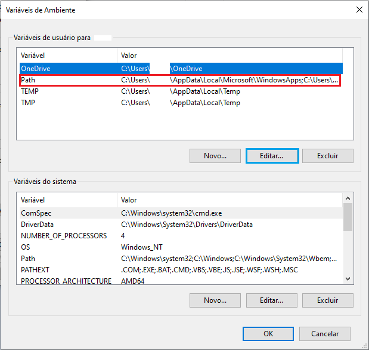

# C/C++ no Windows

## 1 Instale Mingw-w64
---

1. Instale o **Mingw-w64** via [MSYS2](https://www.msys2.org/) [1]. Siga corretamente as instruções de instalação do site, assim como o comando **`pacman`** (`$ pacman -S mingw-w64-ucrt-x86_64-gcc`) no final.
    - Lembre-se do caminho que está sendo instalado o **Mingw-w64**, será necessário para finalizar as configurações.
    - Deixe selecionada a caixa no final da instalação para abrir o terminal do **`msys2`** para executar os comando do **`pacman`**.

2. Após terminada a instalação do **Mingw-w64** e executado o comando **`pacman`** anterior, no terminal do **`msys2`**, execute o seguinte comando para instalar as ferramentas restantes:
    - `$ pacman -S --needed base-devel mingw-w64-x86_64-toolchain`
    - Aceite a instalação padrão (nesse caso apenas pressione **`Enter`**), irá instalar todas as ferramentas.

3. Instale o **`CMake`** via **`pacman`**:
    - `$ pacman -S mingw-w64-x86_64-cmake`

### 1.1 Atualize as Variáveis de Ambiente
---

1. Na _Barra de Pesquisa_ do Windows, pesquise por: **`Editar variaveis ​​de ambiente`**
    - 
2. Clique em **`Variáveis ​​de Ambiente`**.
    - 
3. Em **`Variáveis ​​de usuário para 'NomeUsuarioPC'`**.
    - 
4. Selecione **`Path`** depois clique em **`Editar`**.
    -  
5. Clique em **`Novo`** e cole o caminho para os binários da instalação das ferramentas do **Mingw-w64** (se você seguiu exatamente as instruções de instalação do site [MSYS2](https://www.msys2.org/), então será: **`C:\msys64\mingw64\bin`**).
6. Adicione também o caminho **`C:\msys64`** na variável de ambiente **`Path`**.
7. Finalize tudo clicando nos "_OKs_".

Após ter concluído todos os passos anteriores, **reinicie** o computador para carregar corretamente todas as configurações feitas.

### 1.2 Verifique as Instalações
---

Abra um novo **terminal** e execute os comandos:
```
$ gcc --version
$ g++ --version
$ gdb --version
$ cmake --version
```

Se exibir todas as versões, então todas as ferramentas foram instaladas com sucesso.

## 2 C/C++ no VSCode
---
A partir dos passos anterios, agora podemos usar **`C/C++`** no **VSCode**. Para isso, devemos instalar as seguintes extensões no **VSCode**:
1. C++ extension for VS Code [1]:
    - 
2. CMake Tools extension for VS Code [4]
    - 

### 2.1 Configurando um Projeto com CMake
---

1. No terminal, **crie** uma nova pasta e _abra o **VSCode** a partir dela_ (ou pelo _Explorador de Arquivos_ do Windows, crie uma nova pasta e abra o **VSCode** nela):
    - ```
        $ mkdir cmakeQuickStart
        $ cd cmakeQuickStart
        $ code .
        ```
2. 

## Referências
---

[1]: [Using GCC with MinGW](https://code.visualstudio.com/docs/cpp/config-mingw)

[2]: [Firstly check the system](https://stackoverflow.com/a/74240235/13909139)

[3]: [MSYS2 ](https://www.msys2.org/)

[4]: [Create a CMake project](https://code.visualstudio.com/docs/cpp/cmake-linux#_create-a-cmake-project)


